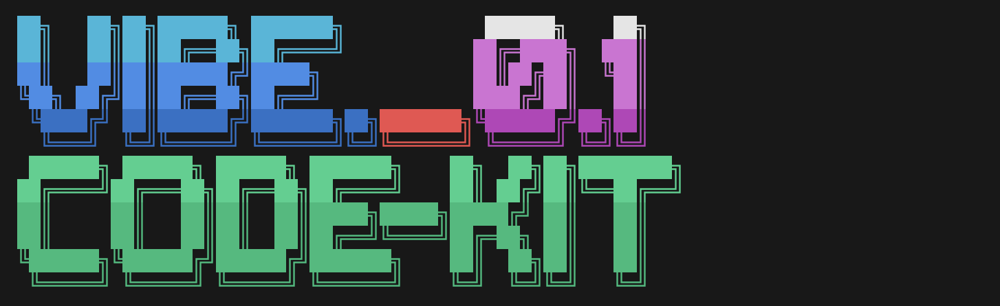

# Vibe-coding-kit



> Vibe coding so chill!

A toolkit for enhancing code maintainability and standardization in Vibe coding through automated configuration initialization for Windsurf/Cursor.

## Features

- **Global and Project Rules**: Pre-configured templates for both global and project-specific Windsurf/Cursor rules
  - Language settings for communication and code comments
  - External tool libraries integration
  - Project documentation templates
  - Code quality standards and best practices enforcement

- **Project Structure**: Automatically generates a standardized project structure
  - Documentation directory (`dev/`) with template files for tracking progress and requirements
  - Enforces code organization principles to improve maintainability

- **CLI Tools**: Command-line utilities to easily initialize and manage your coding environment
  - Automatic detection and creation of `.windsurfrules`/`.cursorrules` files
  - Manage global settings across all projects
  - Override global settings for specific projects

## Installation

```bash
# Clone the repository
git clone https://github.com/dannyxiaocn/vibe-coding-kit.git
cd vibe-coding-kit

# Install the package
pip install -e .

# set up global settings
vibe start --global
```

## Usage

### Initialize a Project

Start with a new project by running:

```bash
# Navigate to your project directory
cd your-project-directory

# Initialize the project with vibe
vibe start
```

This will:
1. Create a project structure with documentation files
2. Set up a `.windsurfrules` or `.cursorrules` file based on your preference
3. Apply global settings if they exist

### Configure Global Settings

Set up your global preferences that will apply to all future projects:

```bash
vibe start --global
```

You'll be able to select:
- Your preferred editor (Windsurf/Cursor)
- Your communication language preference
- Your code comment language preference

### Reset and Override Commands

Reset project rules to default (using global settings):
```bash
vibe reset
```

Override global settings for a specific project:
```bash
vibe reset --override
```

Update global settings (will also update current project if run from a project directory):
```bash
vibe reset --global
```

## Directory Structure

- `vibe_coding_kit/`: Main package code
  - `cli/`: Command-line interface modules
    - `commands.py`: Core command implementations
    - `global_commands.py`: Global settings handling
    - `project_commands.py`: Project-specific functionality
    - `main.py`: CLI entry point
    - `utils.py`: Shared utility functions
- `templates/`: Rule templates for different configurations
  - `global_rules_template.md`: Template for global settings
  - `project_rules_template.md`: Template for project-specific rules

## Benefits

- **Consistency**: Ensures consistent coding standards across projects and team members
- **Time-saving**: Automates repetitive setup tasks and configuration
- **Improved Communication**: Sets clear language preferences for AI-assisted coding
- **Better Documentation**: Encourages structured documentation practices
- **Code Quality**: Promotes best practices through enforced rules

## How It Works

Vibe creates and manages Markdown-based rules files that are recognized by Windsurf/Cursor. These files contain:

1. **Language Rules**: Specify communication and code preferences
2. **Documentation Requirements**: Define expectations for code documentation
3. **Code Structure Guidelines**: Set standards for file organization and size
4. **API Design Patterns**: Promote reusable code patterns

## Contributing

Contributions are welcome! Please feel free to submit a Pull Request.

## DEV TODO
- [ ] test cursor
- [ ] add new features (check `dev/todo.md`)

## License

This project is licensed under the MIT License - see the LICENSE file for details.
